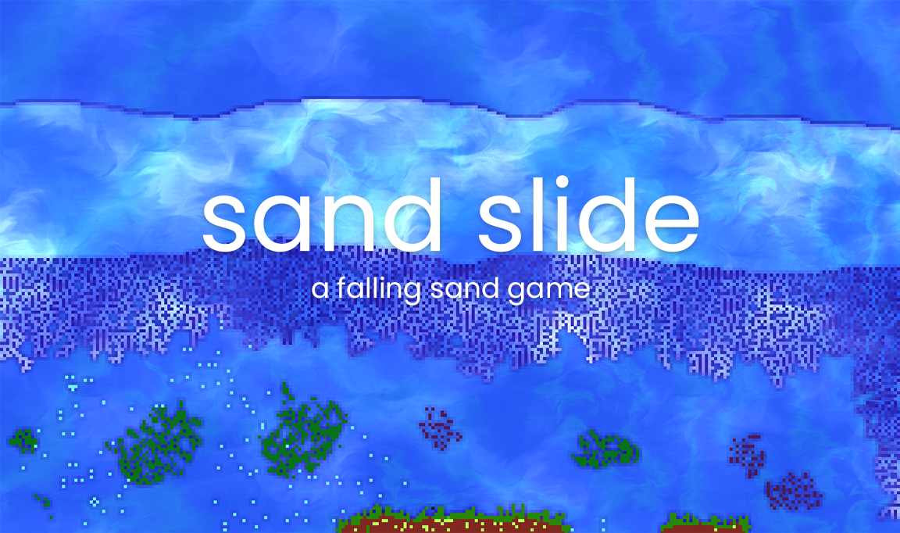
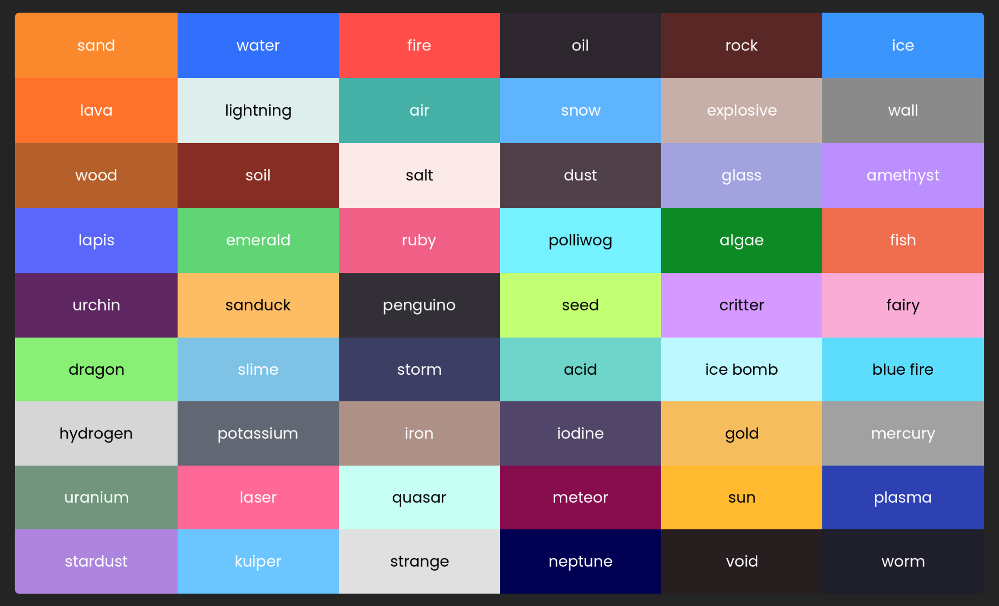

# sand-slide
A falling sand game made with Godot 4.0's GDextension feature. The full game can be downloaded for free on [itch.io](https://kiwijuice56.itch.io/sand-slide) or on the [Google Play Store] (https://play.google.com/store/apps/details?id=org.godotengine.sandslide).





## Project Structure
The project was initialized using a GDExtension template, [GDSummator.](https://github.com/paddy-exe/GDExtensionSummator).

The simulation logic is implemented in C++ as a GDextension (in `extension\src`) that gets compiled into a binary file (in `game\bin`). 
The user interface was created in a Godot 4.0 project (in `game`).

## Set Up
1. Clone the sand-slide repository
2. Download the official [godot-cpp repository](https://github.com/godotengine/godot-cpp/issues/874) and place it at the root of the project directory alongside `game` and `extension`. 
Install the repository that matches your Godot 4.0 version.
3. In a command prompt, navigate to the `godot-cpp` folder and run `scons` (add `target=template_release` for exported projects, or `platform=...` for other devices). You only need to do this the first time you initialize the repository. If you recieve an `Access Denied` error, make sure that the project is not open in another window while compiling.
4. You are now ready to make changes to the project!

## Compiling Changes
To compile any changes, navigate to the root of the project and run `scons`. 
The binaries inside of `game\bin` will update and the changes can be observed once the project is reloaded.

## Creating New Elements
Each element is a class within `extension\src\elements` that inherits the `Element` class. 
To create your own element, create a new `.h` file and define a class with the name of your element.
Your element must inherit the `Element` class and implement the virtual methods `process(*SandSimulation sim, int row, inc col)`, `get_explode_resistance()`, and `get_acid_resistance()`. 

`process(*SandSimulation sim, int row, inc col)` contains the main logic for your element. 
As the simulation iterates through each cell, it will call `process` on the respective `Element` class andpass the `row` and `col` that the cell was encountered in.
Elements have no data or information associated with them, so `process` is essentially a static method that must infer
state from surrounding cells. You can get information and manipulate the simulation by calling methods from the `SandSimulation` pointer. Here is an example for sand:

```cpp
const double FLAME = 1 / 64.0;

void process(SandSimulation *sim, int row, int col) override {
	// randf is a helper method defined within sand_simulation.h that returns a random real number [0, 1)
	if (sim->randf() < FLAME && sim->is_on_fire(row, col)) {
		// Set this cell to glass when on fire
		sim->set_cell(row, col, 25); // 25 is the ID of glass, as explained further below
		return;
	}
	// Otherwise, keep falling
	sim->move_and_swap(row, col, row + 1, col);
}
```

More helper methods can be found in `extension\src\sand_simulation.h`.

`get_explode_resistance()` and `get_acid_resistance()` must return a float [0, 1] in which 0 is no resistance to explosions/acid and 1 is maximum resistance to explosions/acid.

When you are ready to add your element to the game, import the header file in `extension\src\sand_simulation.h` and add it to the `elements` vector in the constructor. 
The index that you add the element to will become its `ID`. Other elements reference this `ID` when checking conditions, such as above where sand is replaced with glass. Glass is placed at the 25th spot of the `elements` vector, so the `ID` of glass is 25.

In the Godot project, create a new `ElementButton` within the `ElementSelector` scene (`main\ui\element_selector\ElementSelector`) and set `ID` to the same one as defined above. The visuals of your element can be modified by creating a resource that extends the `ElementVisual` class and placing it within `game\main\element_visuals\`.

## Save Files
The game allows you to manage save files. Files are stored in `user:\\`, or `%APPDATA%\Godot\app_userdata\sandslide` on Windows. Each folder corresponds to a save file and contains a Godot resource and an image. The luminosity value of each pixel in the texture represents its ID, allowing you to edit the file in an external program and load it back into the game.

## Attribution
[Plumbing](https://icons8.com/icon/67287/plumbing), [eraser](https://icons8.com/icon/78855/eraser), 
[file](https://icons8.com/icon/77782/file), [support](https://icons8.com/icon/60006/support), [help](https://icons8.com/icon/59807/help) and 
[exit](https://icons8.com/icon/71200/close) icons by [Icons8](https://icons8.com/).

Implementation of Bresenham's Line Algorithm by [Saideep Dicholkar](https://saideepdicholkar.blogspot.com/2017/04/bresenhams-line-algorithm-thick-line.html)

GDExtension Starter Project by [paddy-exe](https://github.com/paddy-exe/GDExtensionSummator)
